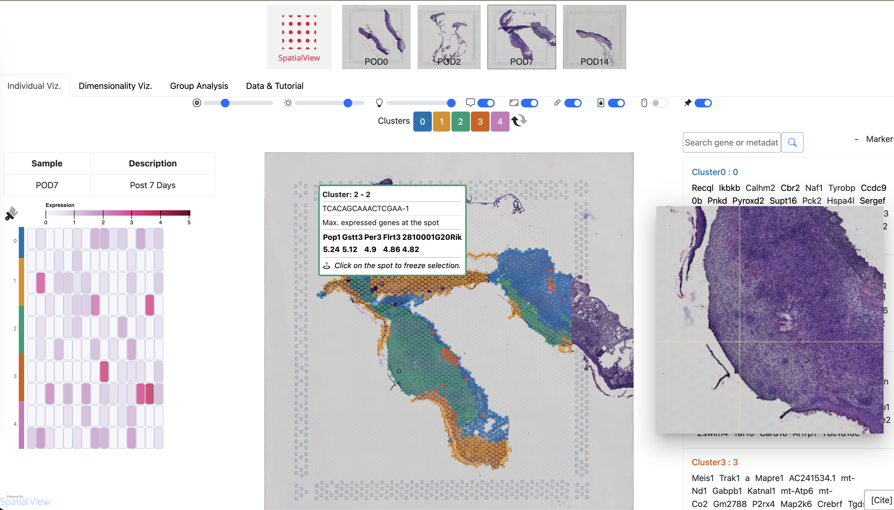

# SpatialView - Demo Application

SpatialView is a web browser-based interactive application to visualize 10x spatial trascriptomics data.
(paper link: *pending publication*).

**[Additional Demo Application: Cancer Micro Environment](https://www.biostat.wisc.edu/~kendzior/spatialviewdemo/)**

**[User Guide](https://raw.githubusercontent.com/kendziorski-lab/kendziorski-lab.github.io/main/projects/spatialview/user_guide.pdf)**

